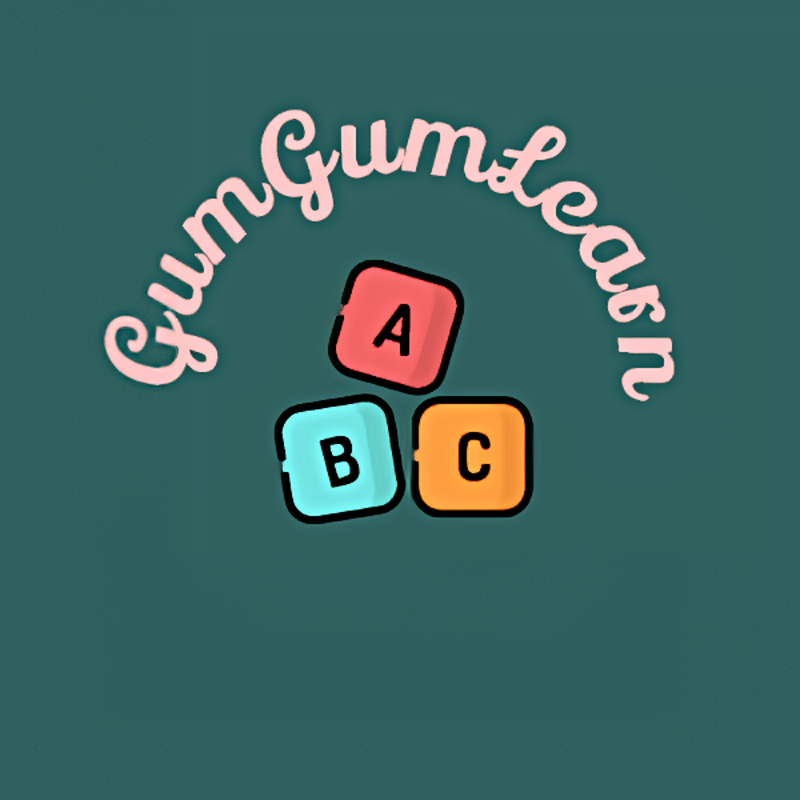

</a>
  

 

---

  
### Quick Links
  

  

  
 
  
 
  

---

**[PROJECT PHILOSOPHY](https://github.com/n1klaus/GumGumLearn#-project-philosophy) • 
[TECH STACK](https://github.com/n1klaus/GumGumLearn#-tech-stack) • 
[CONTRIBUTING](https://github.com/n1klaus/GumGumLearn#%EF%B8%8F-contributing) • 
[SPREAD THE WORD](https://github.com/n1klaus/GumGumLearn#-spread-the-word) • 
[LICENSE](https://github.com/n1klaus/GumGumLearn#%EF%B8%8F-license)**

 

# 🧐 Project philosophy

***Integration over Isolation***

GumGumLearn aims to provide the best way to learn, improve and gauge your English through persnoalized content fueled from yoour search queries hence making internalization and comprehension easier.

# 💡 Inspiration

This project was inspired by my need to track and learn new words i always encountered when reading books or in online publications. It was always easy to highlight on a hard cover but hard to recollect something that struck your mind at a particular time. After a shift to Pdfs and online books the hassle got easier but not completely eradicated. In the process of finishing up a book i always wanted to be able to apply some of the new words but i had no strategy for that. Hence later on i decided to create a key-value storage file to store words and their meanings and synonyms so that if i encountered for example two new  similar words I would be able to make the connection. With time i added features like pronunciation and translation up to this point where i have aggregated all that trial and error into a web application on a broader scope to help learners or people facing the same challenges and also with extra features.

# 👨‍💻 Tech stack

Here's a brief high-level overview of the tech stack GumGumLearn uses:

Database — [PostgreSQL](https://www.postgresql.org/docs/current/index.html) because of its popularity and recommendations from various blogs regarding speed, efficiency, full-text search capabilities, and also the PostgreSQL query cache

Back-end development — [Python3](https://docs.python.org/3.8/) language due to simplicity and flexibility when learning and using new technologies and integration with command line tools for debugging and other alternative uses using CPython implementation, [FastAPI framework]() because of its straightforward documentation, performance advantages, and ease in building REST APIs

Front-end development — [React JS](https://reactjs.org/docs/getting-started.html) framework which provides several memoization techniques and the availability of vast technical blogs and resources to learn from

# ✍️ Contributing

Interested in contributing to the GumGumLearn project? Thanks so much for your interest! We are always looking for improvements to the project and contributions from open-source developers are greatly appreciated.

If you have a contribution in mind, please check out our [Contribution Guide](https://github.com/n1klaus/GumGumLearn/CONTRIBUTING.md) for information on how to do so. Also, make sure you read our [Code of Conduct](https://github.com/n1klaus/GumGumLearn/CODE_OF_CONDUCT.md) to foster an encouraging sense of community.

# 🌟 Spread the word!

If you want to say thank you and/or support active development of the GumGumLearn:

- Fork the project!
- Add a GitHub Star to the project!
- Tweet about the project on your Twitter!
  - Tag [@uncle_saitama](https://twitter.com/uncle_saitama) and/or `#gumgumlearn`

Thanks so much for your interest in growing the reach of the Well app!

# ⚠️ License

GumGumLearn is free and open-source software licensed under the MIT License. All designs were created by [Nick Nyanjui](https://github.com/n1klaus) and distributed under Creative Commons license (CC BY-SA 4.0 International).

 
